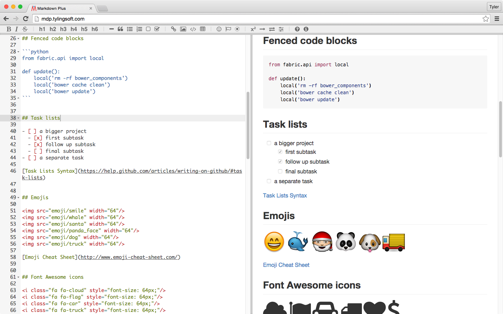
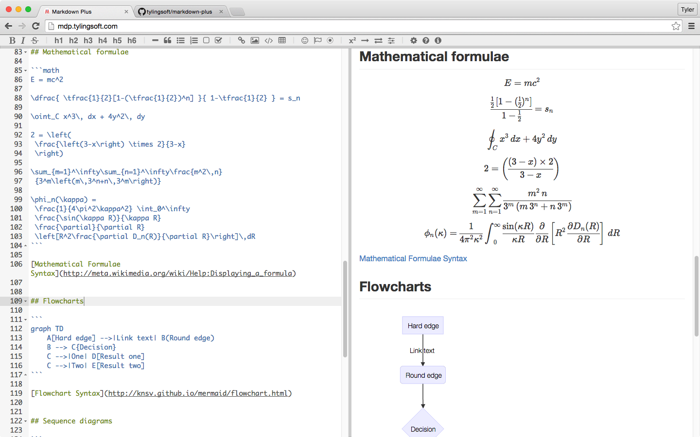
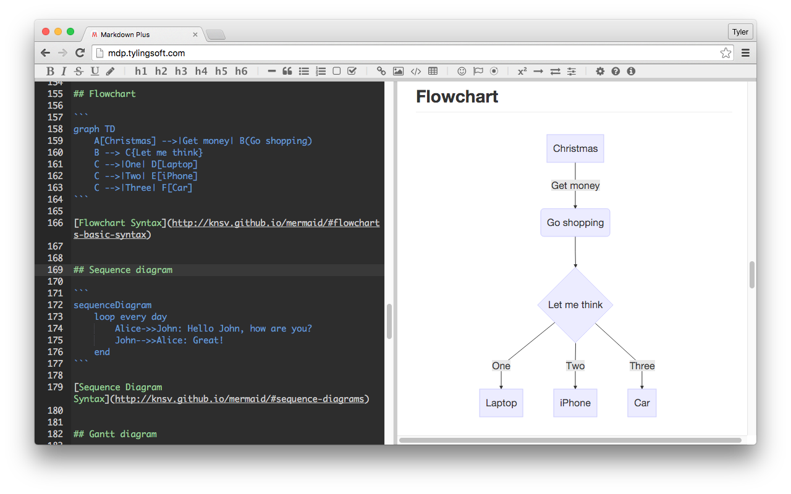

# Markdown Plus


Markdown Plus is a lightweight markdown editor. Besides common markdown, GitHub flavored markdown, it also supports task lists, emojis, Font Awesome icons, Ionicons icons, Mathematical formulae, flowcharts, sequence diagrams and gantt diagrams.


### Online demo: [mdp.tylingsoft.com](http://mdp.tylingsoft.com)

### Screenshots: [#screenshots](#screenshots)


## Features

- ***Simple, only a few hundred lines of code***
- GitHub flavored markdown
- Realtime preview
- Source code highlight
- Task lists
- Emojis
- Font Awesome icons
- Ionicons icons
- Mathematical formulae
- Flowcharts
- Sequence diagrams
- Gantt diagrams


## Mac app

We currently ***don't*** accept donations. The best way to support our development is to [buy our Mac app](https://itunes.apple.com/us/app/markdown-plus/id972585766?mt=8).

[](https://itunes.apple.com/us/app/markdown-plus/id972585766?mt=8)


## Setup & Run

```shell
git clone https://github.com/tylingsoft/markdown-plus.git && cd markdown-plus
bower install
open index.html
```


## How to use Markdown Plus in your projects

Please take `index.html` as an example.


## Thanks

- Thanks to all the dependent open source projects' authors !
- Thank [ASTND](http://www.weibo.com/236986311) for designing the icon !
- Thanks to those who have contributed by creating PRs / issues !
- Thanks to those who have bought our app to support our development !


## License

[The BSD 3-Clause License](http://opensource.org/licenses/BSD-3-Clause)

Copyright © 2015 [Tylingsoft](https://tylingsoft.com/)


---

---

---


# Below is for Chinese speaking


Markdown Plus 是一款轻量级 markdown 编辑器。除了支持通用 markdown、GitHub flavored markdown，它还支持任务列表、Emoji 图标、Font Awesome 图标、Ionicons 图标、数学公式、流程图、顺序图、甘特图。


### 在线演示：[mdp.tylingsoft.com](http://mdp.tylingsoft.com/index.zh_CN.html)

### 屏幕截图: [#screenshots](#screenshots)


## 主要特性

- ***简单，仅有几百行代码***
- GitHub flavored markdown
- 实时预览
- 代码高亮
- 任务列表
- Emoji 图标
- Font Awesome 图标
- Ionicons 图标
- 数学公式
- 流程图
- 顺序图
- 甘特图


## Mac 客户端

目前我们***不接受***无偿捐赠。支持我们开发的最好方式就是购买我们的 [Mac 客户端](https://itunes.apple.com/us/app/markdown-plus/id972585766?mt=8)。

[](https://itunes.apple.com/us/app/markdown-plus/id972585766?mt=8)


## 安装与运行

```shell
git clone https://github.com/tylingsoft/markdown-plus.git && cd markdown-plus
bower install
open index.zh_CN.html
```


## 如何在项目中使用

参考`index.zh_CN.html`，比葫芦画瓢。


## 鸣谢

- 感谢本项目所依赖的众多开源项目的作者！
- 感谢 [ASTND](http://www.weibo.com/236986311) 设计了图标！
- 感谢通过创建 PR、issue 向本项目做贡献的朋友们！
- 感谢众多购买了客户端来支持我们开发的朋友们！


## 软件协议

[BSD 协议](http://opensource.org/licenses/BSD-3-Clause)

版权所有 © 2015 [Tylingsoft](https://tylingsoft.com/)


---

---

---


# Screenshots






