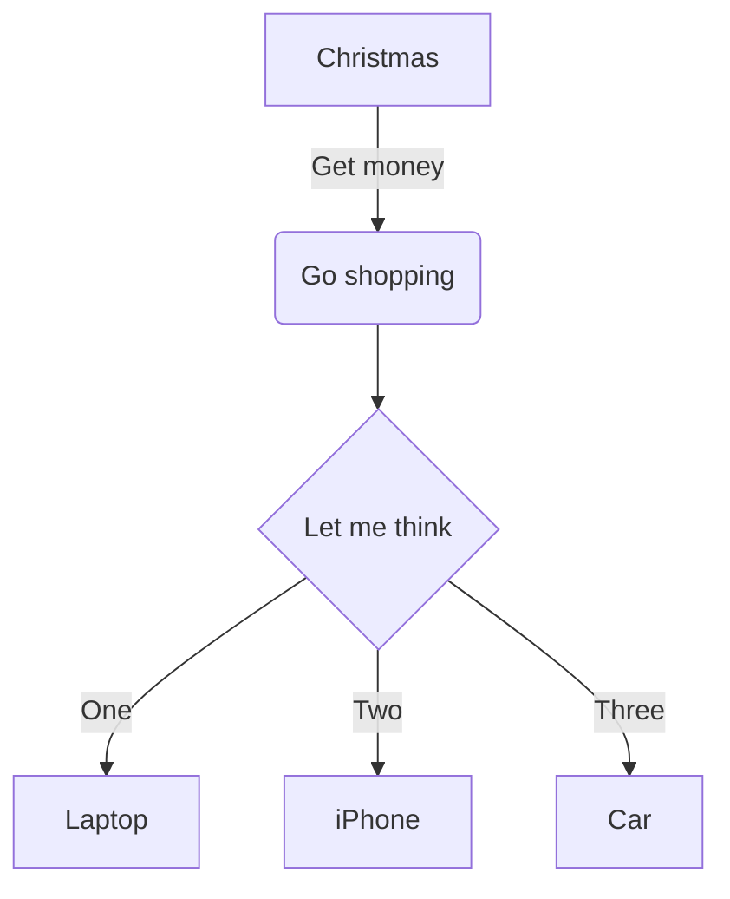
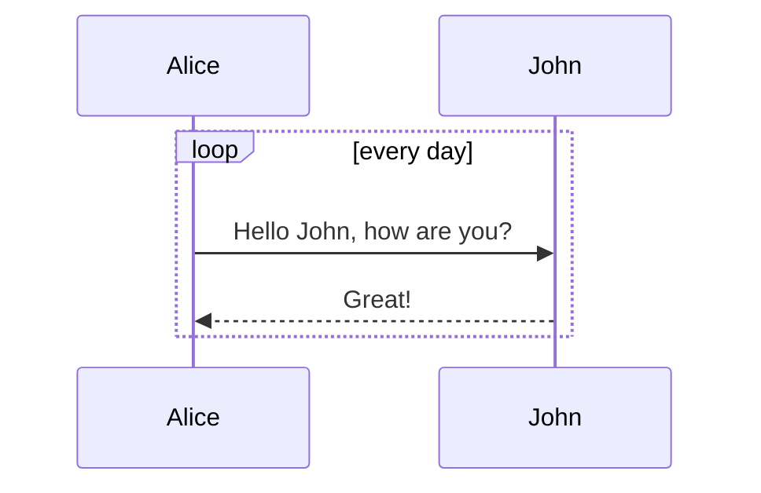
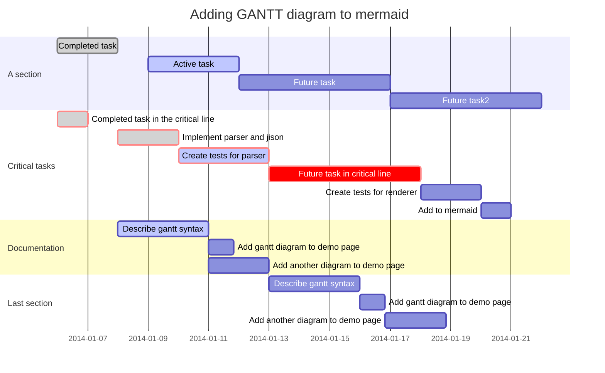

# Markdown Plus

Markdown Plus ("M+" or "mdp" for short) is a markdown editor with extra features.


# Table of Contents

[toc]

Note: Only `h2` & `h3` are shown in toc.

## Mastering Markdown

Markdown allows you to write using an easy-to-read, easy-to-write plain text format, which then converts to valid HTML for viewing.

[Mastering Markdown Guide](https://guides.github.com/features/mastering-markdown/).

## Strikethrough

~~strikethrough~~

## Underline

++insert++

## Mark

==mark==

## Subscript

H~2~O

You can also use inline math: `$H_2O$`

## Superscript

29^th^

You can also use inline math: `$29^{th}$`

## Emoji

:panda_face: :sparkles: :camel: :boom: :pig:

[Emoji Cheat Sheet](https://github.com/ikatyang/emoji-cheat-sheet/blob/master/README.md)

## Fontawesome

:fa-cab: :fa-flag: :fa-bicycle: :fa-leaf: :fa-heart:

[All the Font Awesome icons](https://github.com/gluons/Font-Awesome-Icon-Chars/blob/master/character-list/character-list.yaml)

## Code snippets

Inline: `print 'hello code'`

    evens = [1, 2, 3, 4, 5].collect do |item|
      item * 2
    end

```ts
async function fetchItems<T>(url: string): Promise<T[]> {
  const response = await fetch(url);
  if (!response.ok) {
    throw new Error(`Error fetching data: ${response.statusText}`);
  }
  const data: T[] = await response.json();
  return data;
}
```

[Code Formatting](https://docs.github.com/en/get-started/writing-on-github/working-with-advanced-formatting/creating-and-highlighting-code-blocks)

## Tables and alignment

| First Header                | Second Header                |
| --------------------------- | ---------------------------- |
| Content from cell 1         | Content from cell 2          |
| Content in the first column | Content in the second column |

| Left-Aligned | Center Aligned  | Right Aligned |
| :----------- | :-------------: | ------------: |
| col 3 is     | some wordy text |         $1600 |
| col 2 is     |    centered     |           $12 |

[Table Syntax](https://docs.github.com/en/get-started/writing-on-github/working-with-advanced-formatting/organizing-information-with-tables)

## Task list

- [ ] a bigger project
  - [x] first subtask
  - [x] follow up subtask
  - [ ] final subtask
- [ ] a separate task

[Task List Syntax](https://docs.github.com/en/get-started/writing-on-github/getting-started-with-writing-and-formatting-on-github/basic-writing-and-formatting-syntax#task-lists)

## Footnote

Here is a footnote reference,[^1] and another.[^longnote]

[^1]: Here is the footnote.

[^longnote]: Here's one with multiple blocks.

    Subsequent paragraphs are indented to show that they
    belong to the previous footnote.

Here is an inline note.^[Inlines notes are easier to write, since
you don't have to pick an identifier and move down to type the
note.]

[Footnote Syntax](https://pandoc.org/MANUAL.html#footnotes)

## Mathematical formula

Inline math: `$\dfrac{ \tfrac{1}{2}[1-(\tfrac{1}{2})^n] }{ 1-\tfrac{1}{2} } = s_n$`.

Math block:

```katex
\oint_C x^3\, dx + 4y^2\, dy

2 = \left(
 \frac{\left(3-x\right) \times 2}{3-x}
 \right)

\sum_{m=1}^\infty\sum_{n=1}^\infty\frac{m^2\,n}
 {3^m\left(m\,3^n+n\,3^m\right)}

\phi_n(\kappa) =
 \frac{1}{4\pi^2\kappa^2} \int_0^\infty
 \frac{\sin(\kappa R)}{\kappa R}
 \frac{\partial}{\partial R}
 \left[R^2\frac{\partial D_n(R)}{\partial R}\right]\,dR
```

[Mathematical Formula Syntax](https://www.mediawiki.org/wiki/Extension:Math/Syntax)

## AsciiMath

Inline AsciiMath: `@(1/2[1-(1/2)^n])/(1-(1/2))=s_n@`

```AsciiMath
oint_Cx^3 dx+4y^2 dy

2=(((3-x)xx2)/(3-x))

sum_(m=1)^oosum_(n=1)^oo(m^2 n)/(3^m(m3^n+n3^m)
```

```ASCIIMath
phi_n(kappa) = 1/(4pi^2 kappa^2)
 int_0^oo (sin(kappa R))/(kappa R)
 del/(del R)
[R^2 (del D_n (R))/(del R)] del R
```

[AsciiMath Documentation](https://asciimath.org/)

## Mermaid charts

### Flowchart



[Flowchart Syntax](http://knsv.github.io/mermaid/#flowcharts-basic-syntax)

::: warning
Adding many flowcharts will slow down the editor.
:::

### Sequence diagram



[Sequence Diagram Syntax](http://knsv.github.io/mermaid/#sequence-diagrams)

::: warning
Adding many sequence diagrams will slow down the editor.
:::

### Gantt diagram



[Gantt Diagram Syntax](http://knsv.github.io/mermaid/#gant-diagrams)

::: warning
Adding many gantt diagrams will slow down the editor.
:::

## Custom Container

Markup is similar to fenced code blocks. Valid container types are `success`, `info`, `warning` and `danger`.

::: info
You have new mail.
:::

::: danger
Staying up all night is bad for health.
:::

## Definition list

Term 1
~ Definition 1

Term 2
~ Definition 2a
~ Definition 2b

[Definition List Syntax](https://pandoc.org/MANUAL.html#definition-lists)

## HTML

If you find the markdown syntax too limited, you can try some <span style="color: blue;">HTML<span>:

<p style="text-align:center;"></p>

<a href="https://github.com/tylerlong/markdown-plus/" target="_blank"></a>

## Chart.js

[Documentation for charts](https://www.chartjs.org/docs/latest/)

```chart
{
  "type": "line",
  "data": {
    "labels": [
      "January",
      "February",
      "March",
      "April",
      "May",
      "June",
      "July"
    ],
    "datasets": [
      {
        "label": "# of bugs",
        "fill": false,
        "lineTension": 0.1,
        "backgroundColor": "rgba(75,192,192,0.4)",
        "borderColor": "rgba(75,192,192,1)",
        "borderCapStyle": "butt",
        "borderDash": [],
        "borderDashOffset": 0,
        "borderJoinStyle": "miter",
        "pointBorderColor": "rgba(75,192,192,1)",
        "pointBackgroundColor": "#fff",
        "pointBorderWidth": 1,
        "pointHoverRadius": 5,
        "pointHoverBackgroundColor": "rgba(75,192,192,1)",
        "pointHoverBorderColor": "rgba(220,220,220,1)",
        "pointHoverBorderWidth": 2,
        "pointRadius": 1,
        "pointHitRadius": 10,
        "data": [
          65,
          59,
          80,
          81,
          56,
          55,
          40
        ],
        "spanGaps": false
      }
    ]
  },
  "options": {}
}
```
